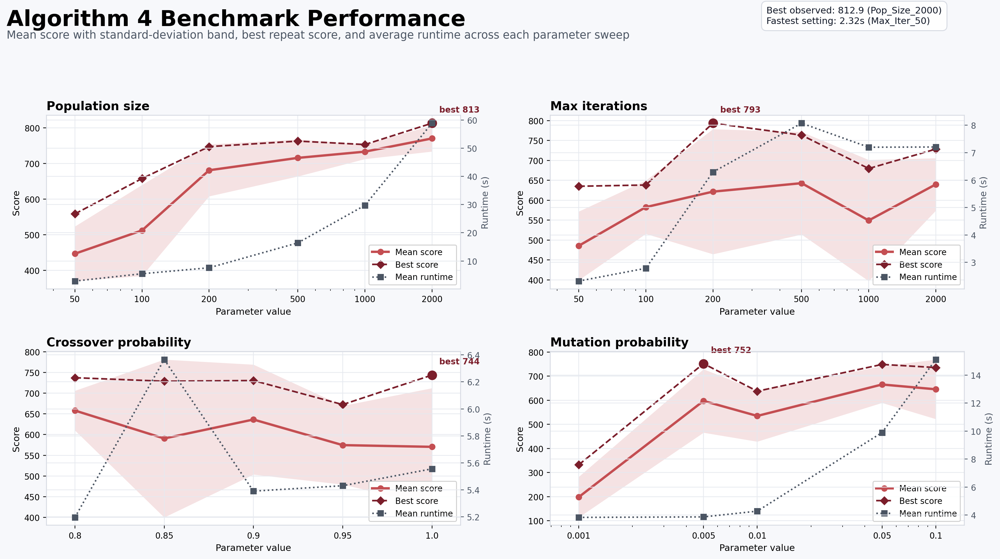
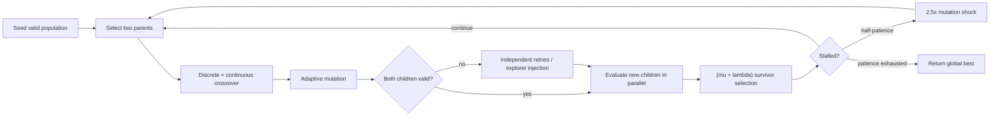

# Hybrid Mineral Circuit Optimizer

[](https://isocpp.org/)
[](https://www.openmp.org/)
[](LICENSE)
[](https://github.com/ada-ty125/hybrid-mineral-circuit-optimizer/actions/workflows/run_tests.yml)

> A C++20/OpenMP search engine for jointly optimizing a mineral-separation circuit's discrete
> topology and continuous operating parameters under strict feasibility constraints.

[中文说明](README.zh-CN.md) · [Benchmark methodology](docs/BENCHMARKS.md) ·
[Contribution record](docs/CONTRIBUTIONS.md)



## Results at a glance

On the checked-in five-run sweep with population `2000`, `200` generations, and the same
objective function:

| Metric | Baseline | Hybrid GA | Change |
|---|---:|---:|---:|
| Mean economic score | 323.34 | 770.13 | **2.38x** |
| Best observed score | 361.93 | **812.93** | +124.6% |
| Mean runtime | 261.87 s | **58.84 s** | **4.45x faster** |

These are empirical results on one Apple Silicon machine, not universal guarantees. The raw runs,
summary statistics, environment, and comparison rules are documented in
[docs/BENCHMARKS.md](docs/BENCHMARKS.md).

## Why this is a mixed optimization problem

Each candidate combines two coupled representations:

- a variable circuit graph: feed entry, separation-unit types, and stream destinations;
- continuous operating parameters used by the physical/metallurgical simulator.

The search must preserve graph validity while optimizing an expensive, non-convex economic
objective. Invalid children cannot simply be scored, and evaluating every survivor again wastes
the dominant simulation cost.



## Engineering highlights

- **Hybrid chromosome:** multi-point crossover for topology and linear/Gaussian operators for
  continuous variables behind one optimizer interface.
- **Constraint-safe breeding:** each child is captured independently; repeated invalid offspring
  trigger a fresh valid explorer instead of silently cloning a parent.
- **Stagnation escape:** the mutation probability is multiplied by `2.5` after half the early-stop
  patience window is consumed.
- **Thread-local randomness:** OpenMP workers own independent `std::mt19937` instances, avoiding a
  shared RNG lock and data race.
- **Incremental evaluation:** parents retain cached fitness; only newly generated children enter the
  parallel simulator evaluation stage before `(mu + lambda)` selection.
- **Reproducible runs:** `GA_SEED`, `GA_CONVERGENCE_CSV`, and `GA_PROGRESS_EVERY` control seeded runs
  and machine-readable convergence output.
- **Two topology modes:** fixed unit layouts and a swappable mode that evolves unit types alongside
  connectivity.

The primary implementation is [src/Genetic_Algorithm.cpp](src/Genetic_Algorithm.cpp). Historical
variants used for the ablation study are retained under [benchmarks/variants](benchmarks/variants).

## Quick start

Requirements: CMake 3.10+, a C++20 compiler, OpenMP, and Git. On macOS with AppleClang, install
Homebrew's runtime first with `brew install libomp`; CMake discovers the Apple Silicon and Intel
Homebrew prefixes automatically.

```bash
git clone --recursive https://github.com/ada-ty125/hybrid-mineral-circuit-optimizer.git
cd hybrid-mineral-circuit-optimizer
cmake -S . -B build -DCMAKE_BUILD_TYPE=Release
cmake --build build --parallel
ctest --test-dir build --output-on-failure
```

Run a small deterministic optimization:

```bash
GA_SEED=20260521 ./build/bin/Circuit_Optimizer \
  --population-size 100 \
  --max-iterations 200 \
  --crossover-probability 0.9 \
  --mutation-probability 0.01 \
  --tournament-size 3 \
  --early-stop-patience 50 \
  --num-crossover-points 2 \
  --elite-count 1 \
  --mode fixed \
  --output optimal_circuit.png
```

Use `./build/bin/Circuit_Optimizer --help` for the full named and positional CLI.

## Reproduce the ablation benchmark

The full sweep is intentionally expensive: four implementations × 22 parameter settings × five
repeats.

```bash
./scripts/benchmark_ga_variants.sh \
  --cpp Baseline:benchmarks/variants/Genetic_Algorithmbaseline.cpp \
  --cpp NaiveOpenMP:benchmarks/variants/Genetic_AlgorithmNaiveOPenMP.cpp \
  --cpp Algo3:benchmarks/variants/Genetic_AlgorithmAlgo3.cpp \
  --cpp Algo4:src/Genetic_Algorithm.cpp \
  --repeats 5

python3 scripts/plot_ga_benchmark.py \
  build/ga_benchmark/ga_benchmark_summary.csv \
  -o build/ga_benchmark/ga_benchmark_scores.png
```

Pass `--check-only` to compile and smoke-test all variants without launching the sweep.

## Authorship and project lineage

This is a portfolio edition of the **Cuprite Team** group project. Tianyu Yang led the genetic
algorithm workstream and later built the reproducibility and benchmark harness; the simulator,
economics model, validity checker, visualization, and integration are team work. The original Git
history and all eight team members remain in this repository so individual contributions are
auditable.

See [docs/CONTRIBUTIONS.md](docs/CONTRIBUTIONS.md) for scope and commit evidence. The original team
copyright notice is preserved in [LICENSE](LICENSE). The project is not affiliated with or endorsed
by a commercial mineral-processing company.

## Repository map

| Path | Purpose |
|---|---|
| `src/Genetic_Algorithm.cpp` | Hybrid GA, OpenMP breeding/evaluation, fallbacks, caching |
| `src/Circuit_Optimization_Problem.cpp` | Circuit encodings, validity bridge, objective wiring |
| `src/CSimulator.cpp`, `src/Economics.cpp` | Physical simulation and economic objective |
| `benchmarks/data/` | Raw and summarized benchmark evidence |
| `benchmarks/variants/` | Baseline and ablation implementations |
| `scripts/` | Benchmark, reliability, plotting, and HPC helpers |
| `tests/` | Unit, integration, economics, and simulator tests |

## License

MIT, copyright Cuprite Team. See [LICENSE](LICENSE).
